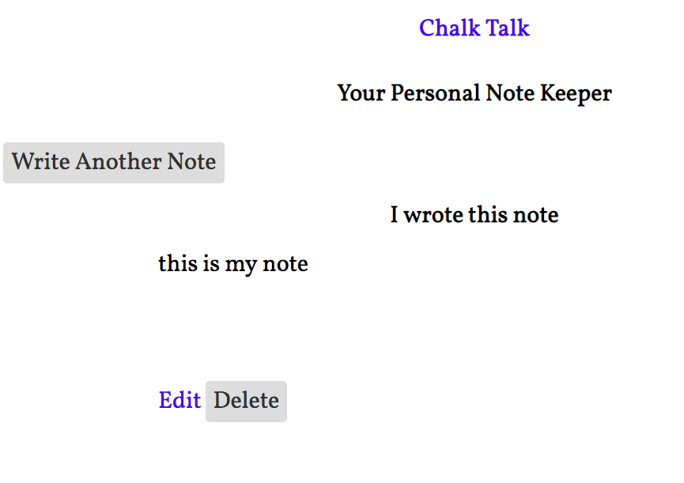

# Notes Application

This application uses React and pouchDB to deliver full CRUD for creating, updating, deleting, and reading notes. 

pouchDB is an open-source JavaScript database that allows developers to build applications that work as well offline as they do online. pouchDB enables applications to store data locally while offline, then synchronize it with CouchDB, a NoSQL database. You can learn more at https://pouchdb.com/

if cloning down: run npm install

Planning

Stage 1:

Stage 2: 

